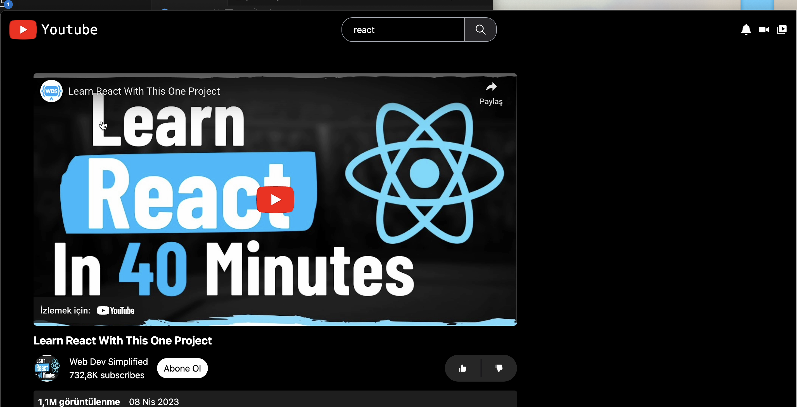
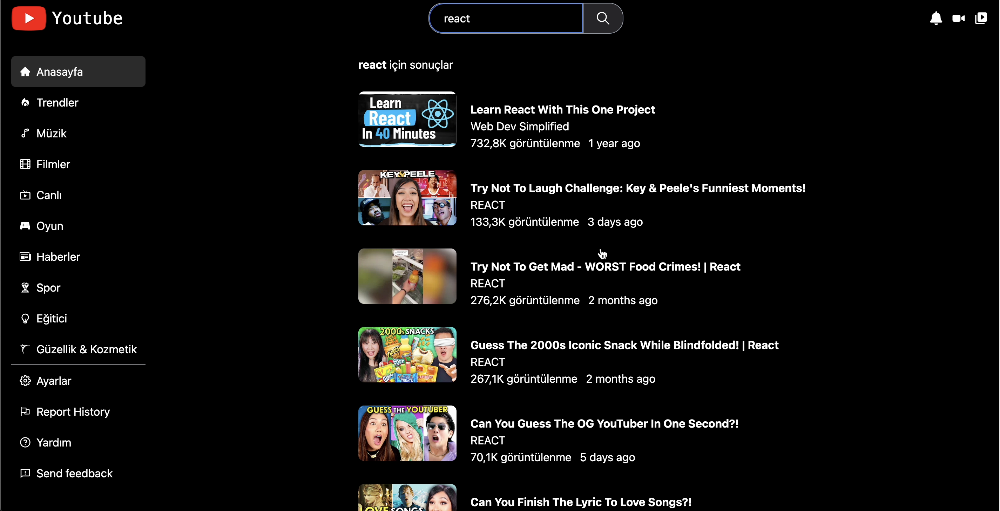

<h1> This is a kind of Youtube Clone Wep Aplication </h1>

<h2>Content</h2>

## ******* For React enthusiasts ******

<h3>

*Designed using react vite  

*Although the application is responsive, it also offers a dynamic structure to the user. 

*Limited data can be accessed from the YouTube application's resources Rapid API, and the search field by genre is available in the interface. 

*There is a side bar on the left side of the screen and you can access trending videos, movies, music, sports, etc. from here. 
*
Warning!!
However, since there may be problems with the data coming from the API used, you may receive an error in the image coming to the interface. 
*
Visuality was achieved more modernly with the tailwind library, and a more effective image was obtained by adding grid structures with the help of index.css. 

*This web application can be improved by adding many more features. 

</h3>

# #  Lİbraries Used

-axios
-react-player
-react-icons
-millify(number formatting)
-moment(time formating )
-react-router-dom
-react-dom
-tailwind css

<h2>here is video gif</h2>

<h2>here are the ScreenShoots</h2>

<h3> result page </h3>

<h3>video detail detail page </h3>

